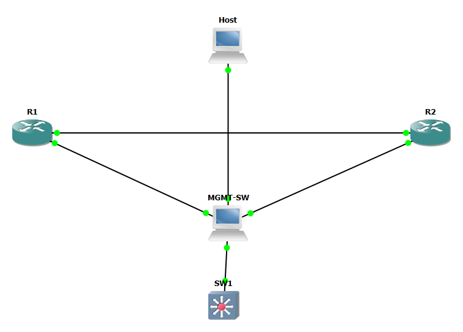
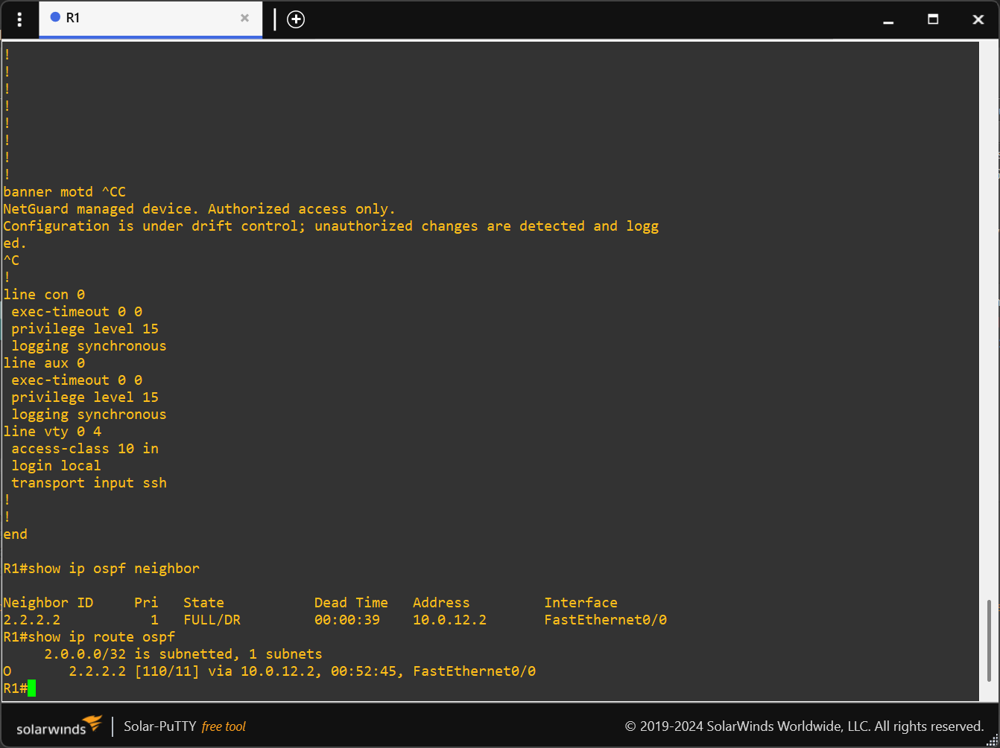
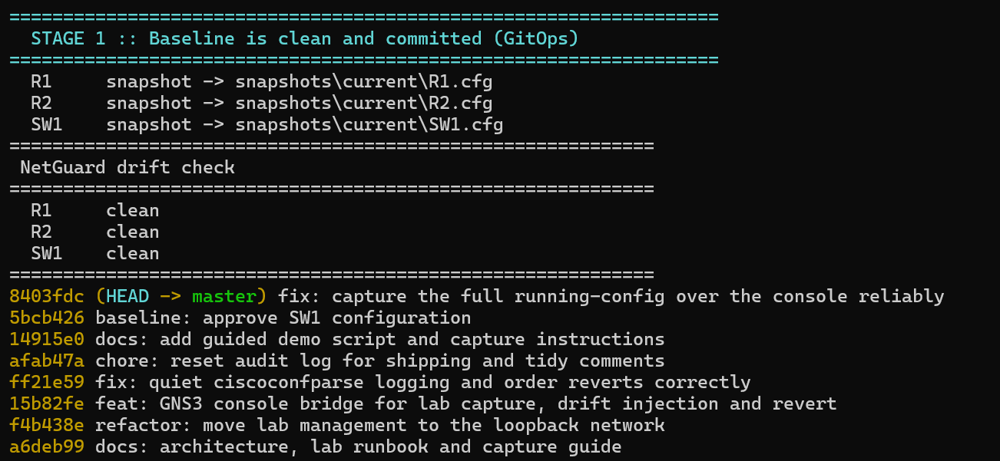
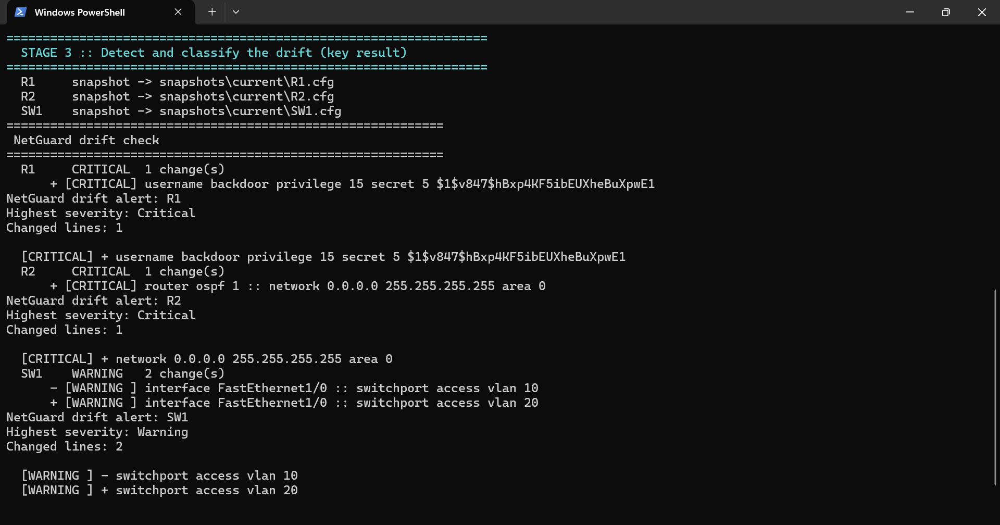
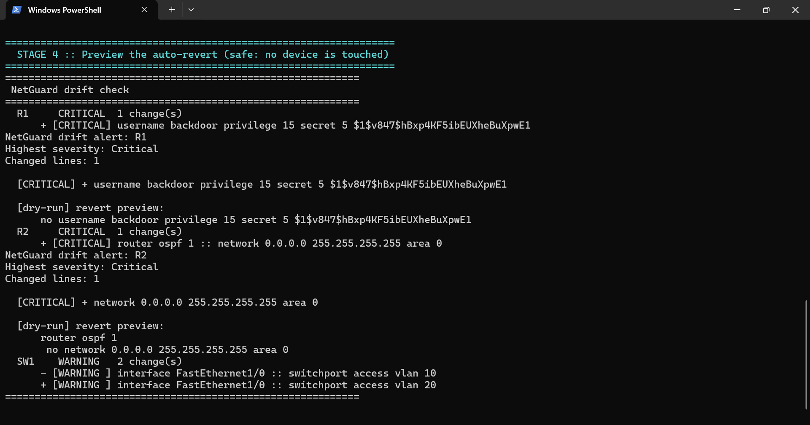
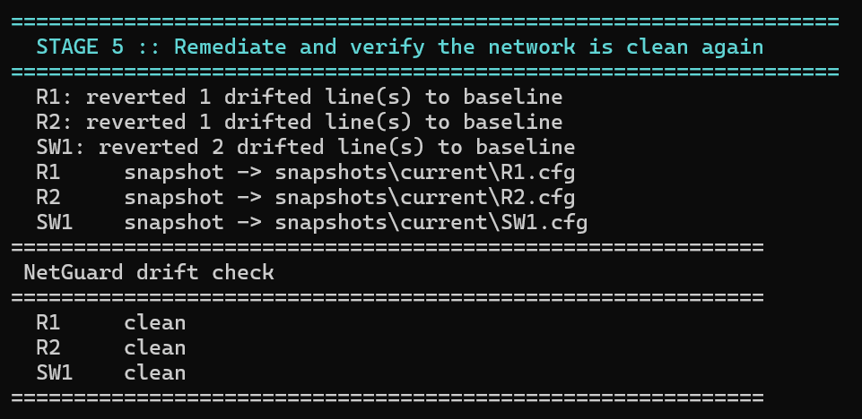

# NetGuard - Configuration Drift Detection & GitOps Compliance Engine

A Python engine that treats Cisco IOS configurations as version-controlled code,
detects unauthorised changes against a git-committed golden baseline, classifies
them by operational severity, alerts, and can safely revert critical changes.
Built and demonstrated on a GNS3 lab.

> This is a lab project, built on GNS3, and presented as such. Nothing here was
> deployed to production hardware.

## The problem

On any production network an engineer can log into a device and change its
running configuration - add a VLAN, edit an ACL, tweak a routing metric - with no
ticket, review, or record. That divergence between the approved configuration and
what is actually running is *configuration drift*, and it is a leading cause of
outages, security gaps and failed audits. Commercial tools solve it
(Cisco DNA Center, SolarWinds NCM, Itential) but are expensive, closed and
heavier than a small network needs. NetGuard is a small, transparent take on the
same idea: configuration as code, with git as the source of truth.

## What it does

- Stores every device's approved configuration as a git-committed baseline
- Pulls the live running-config (Netmiko/SSH) and diffs it against that baseline
- Resolves the parent block of every changed line, so an `ip address` change is
  reported against its interface, not as a floating line (ciscoconfparse)
- Classifies each change by severity from a data-driven policy: CRITICAL for
  routing, access-control and authentication; WARNING for VLAN and interface
  changes; INFO for cosmetic changes
- Alerts on drift at or above a threshold (console, optional email)
- Safely reverts CRITICAL drift, defaulting to a dry-run that prints the exact
  commands before anything is applied
- Appends every check to an audit log and can generate a Markdown report

## Lab topology

R1 and R2 form an OSPF area-0 core over a /30, each with a loopback advertised
into OSPF. SW1 is an EtherSwitch with VLAN access ports. A management switch
bridges every device to the host. The whole topology is built from code by
`provision_lab.py` through the GNS3 REST API.



```
     R1 Fa0/0 ------ 10.0.12.0/30 (OSPF area 0) ------ Fa0/0 R2
   (Lo0 1.1.1.1)                                        (Lo0 2.2.2.2)
     R1 Fa0/1 --.                                    .-- Fa0/1 R2
                |                                    |
               MGMT-SW ------------------------------ Host (10.99.99.0/24)
                |
     SW1 Fa0/0 -'     SW1 Fa1/0-3: VLAN 10 / 20 access ports
```

OSPF adjacency, verified live:



## Demonstration

The baseline is captured live from each device and committed, so git records the
approved state of the network:



An unauthorised change is then made on each device (a rogue admin on R1, an
over-broad OSPF network on R2, a VLAN move on SW1) and detected:



```
============================================================
 NetGuard drift check
============================================================
  R1     CRITICAL  1 change(s)
      + [CRITICAL] username backdoor privilege 15 secret 5 $1$v847$hBxp4KF5ibEUXheBuXpwE1
  R2     CRITICAL  1 change(s)
      + [CRITICAL] router ospf 1 :: network 0.0.0.0 255.255.255.255 area 0
  SW1    WARNING   2 change(s)
      - [WARNING ] interface FastEthernet1/0 :: switchport access vlan 10
      + [WARNING ] interface FastEthernet1/0 :: switchport access vlan 20
============================================================
```

The remediation is previewed first, without touching a device; only CRITICAL
drift is targeted, and the OSPF revert re-enters the routing process before
negating the network statement:



Remediation is then applied over the console and every device returns to `clean`:



## Tech stack

| Concern         | Choice                                   |
|-----------------|------------------------------------------|
| Device access   | Netmiko (SSH); console for the GNS3 lab  |
| Diffing         | `difflib` + `ciscoconfparse` (semantic)  |
| Version control | git (baselines are committed)            |
| Severity policy | `policy.yaml` (data, not code)           |
| Alerting        | console, optional `smtplib` email        |
| Lab build       | GNS3 v2 REST API (`provision_lab.py`)    |
| Tests           | pytest                                   |

## Repository layout

```
drift_engine.py        detection CLI (check / capture-baseline / diff)
provision_lab.py       builds the GNS3 topology from code
lab_console.py         GNS3 console bridge (snapshot / inject / revert)
policy.yaml            severity rules
netguard/              engine package (inventory, differ, classifier, ...)
configs/intended/      intended device configs pushed at provision time
baselines/             git-tracked golden configs
tests/                 unit tests
docs/                  architecture, runbook, capture guide
```

## Setup

```
python -m venv .venv
.venv\Scripts\pip install -r requirements.txt
copy devices.yaml.example devices.yaml    # then fill in credentials
```

## Usage

```
# detect drift against the committed baselines
python drift_engine.py check

# approve the current configuration as the new baseline (commits to git)
python drift_engine.py capture-baseline

# preview an auto-revert of critical drift without touching devices
python drift_engine.py check --auto-revert --dry-run

# offline compare of two files, no device required
python drift_engine.py diff --baseline baselines/R1.cfg --running snapshots/current/R1.cfg
```

The full lab walkthrough is in [docs/runbook.md](docs/runbook.md); the design is
in [docs/architecture.md](docs/architecture.md).

## Tests

```
python -m pytest
```

The suite covers normalisation, diffing (including parent-block resolution), the
full severity matrix and remediation command generation, all against fixtures so
no device is needed.

## Challenges faced

- **Host-to-node connectivity under GNS3 on Windows.** SSH from the host to the
  emulated devices failed even though the devices could reach the host. The cause
  is Npcap not bridging host-originated frames on the host-only adapter (the
  loopback adapter did not help either). Rather than fight it, I drive the lab
  over the device console (`lab_console.py`, reading console ports from the GNS3
  API) and keep SSH as the production transport. OSPF, routing and the detection
  logic are unaffected.
- **SSH keys are not part of a config.** The RSA key pair SSH needs cannot be
  stored in a startup-config, so provisioning is followed by a one-time console
  step that generates the key and saves it.
- **VLAN visibility on the EtherSwitch.** On the c3725 NM-16ESW, VLAN definitions
  live in `vlan.dat` and do not appear in the running-config, so VLAN drift is
  detected at the switchport (`switchport access vlan`), which is both visible in
  the config and a meaningful segmentation signal.
- **Diff noise.** Secret hashes are stable once saved, so they are compared as-is
  (a password change is real drift). Genuinely volatile lines - the header block,
  byte counts, `ntp clock-period` - are normalised out to avoid false positives.

## Limitations and future work

- Multi-vendor support (Juniper, Arista) - the engine is IOS-only today.
- Remediation handles global and single-level interface changes; a full
  context-aware config replace is future work.
- Scheduling is documented rather than bundled; a check is a good fit for Task
  Scheduler or cron.
